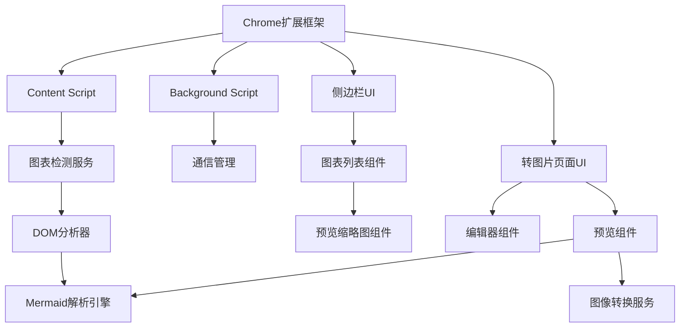
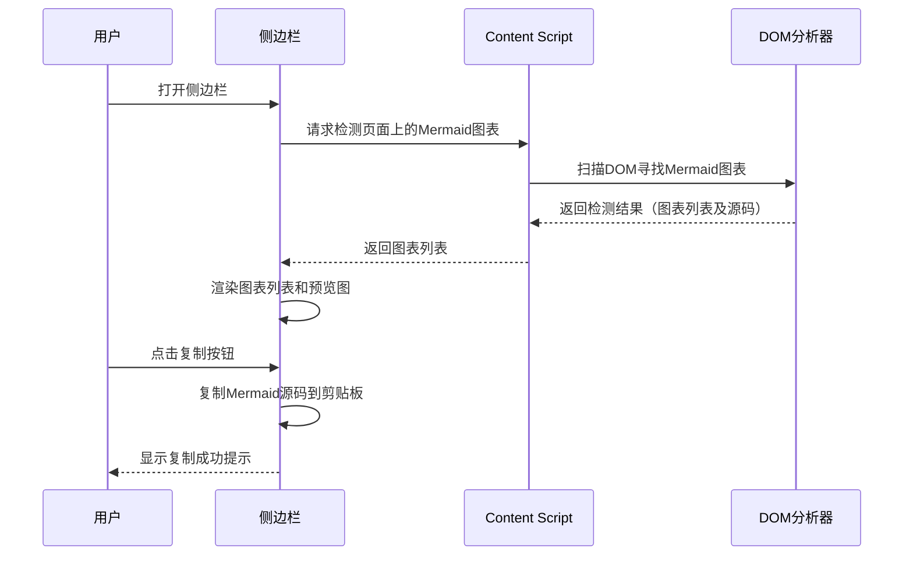
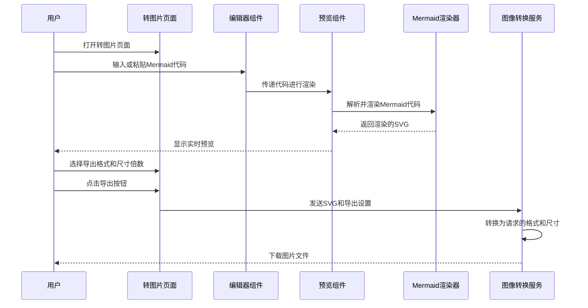
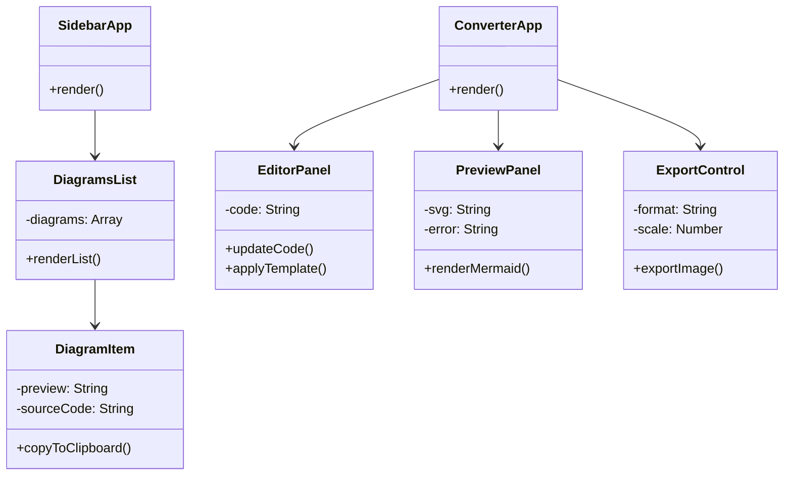

# Mermaid图表提取与转换 Chrome插件 - 技术文档

## 1. 架构设计

### 1.1 总体架构

本项目是一个基于React的Chrome扩展，遵循Manifest V3规范。整体架构如下：



### 1.2 主要模块

1. **内容脚本 (Content Script)**
   - 负责检测和分析当前页面
   - 识别页面中的Mermaid图表元素
   - 提取Mermaid源代码
   - 创建图表缩略预览

2. **侧边栏界面 (Sidebar UI)**
   - 显示检测到的Mermaid图表列表
   - 提供预览缩略图
   - 提供复制源代码功能
   - 显示检测统计和提示信息

3. **转图片页面 (Converter UI)**
   - 在独立页面中提供编辑和预览功能
   - 实时渲染Mermaid图表
   - 提供多格式导出选项
   - 图片尺寸倍数选择

4. **后台脚本 (Background Script)**
   - 管理插件生命周期
   - 处理消息通信
   - 维护插件状态
   - 管理页面导航

5. **Mermaid渲染器 (Renderer)**
   - 解析和渲染Mermaid代码
   - 提供实时预览功能
   - 处理渲染错误
   - 适配不同尺寸

### 1.3 数据流程

**A. Mermaid图表文本提取流程**



**B. Mermaid转图片流程**



## 2. 技术实现

### 2.1 Mermaid图表检测算法

为了从网页中准确检测Mermaid图表，我们采用以下策略：

1. **选择器检测方法**
   - 检测带有`.mermaid`类的元素
   - 检测带有`data-processed`属性的Mermaid图表
   - 检测可能的Mermaid SVG图表的特征标记

2. **源代码提取技术**
   - 从原始HTML中查找包含Mermaid代码的注释或属性
   - 从DOM元素的data属性中提取可能存储的源代码
   - 分析脚本部分寻找Mermaid定义

```javascript
// 检测Mermaid图表的伪代码
function detectMermaidDiagrams() {
  // 查找明确标记的Mermaid元素
  const markedElements = document.querySelectorAll('.mermaid');
  
  // 查找SVG元素，可能是Mermaid渲染结果
  const svgElements = document.querySelectorAll('svg[data-processed="true"]');
  
  // 额外检测可能未明确标记的Mermaid图表
  const potentialElements = detectUnmarkedMermaidElements();
  
  // 为每个检测到的元素创建缩略预览
  const diagrams = [...markedElements, ...svgElements, ...potentialElements].map(element => {
    return {
      element,
      sourceCode: extractMermaidSource(element),
      preview: generateThumbnail(element)
    };
  });
  
  return diagrams;
}
```

### 2.2 侧边栏界面实现

使用Chrome扩展的侧边栏API和React组件创建图表列表界面：

```javascript
// 侧边栏组件伪代码
const SidebarUI = () => {
  const [diagrams, setDiagrams] = useState([]);
  const [loading, setLoading] = useState(true);
  
  useEffect(() => {
    // 初始化时请求检测结果
    chrome.tabs.query({active: true, currentWindow: true}, (tabs) => {
      chrome.tabs.sendMessage(tabs[0].id, {action: "detectMermaidDiagrams"}, (response) => {
        setDiagrams(response.diagrams || []);
        setLoading(false);
      });
    });
  }, []);
  
  const copyToClipboard = (sourceCode) => {
    navigator.clipboard.writeText(sourceCode)
      .then(() => {
        // 显示复制成功通知
        showNotification("已复制到剪贴板");
      });
  };
  
  return (
    <div className="sidebar-container">
      <h1>Mermaid图表提取器</h1>
      
      {loading ? (
        <LoadingIndicator />
      ) : diagrams.length > 0 ? (
        <>
          <div className="diagrams-list">
            {diagrams.map((diagram, index) => (
              <DiagramItem 
                key={index}
                preview={diagram.preview}
                sourceCode={diagram.sourceCode}
                onCopy={() => copyToClipboard(diagram.sourceCode)}
              />
            ))}
          </div>
          <div className="status-bar">
            共检测到 {diagrams.length} 个Mermaid图表
          </div>
        </>
      ) : (
        <div className="empty-state">
          当前页面未检测到Mermaid图表
        </div>
      )}
      
      <button 
        className="convert-button"
        onClick={() => chrome.tabs.create({url: 'converter.html'})}
      >
        打开Mermaid转图片工具
      </button>
    </div>
  );
};
```

### 2.3 转图片页面实现

使用React构建左右布局的转图片页面：

```javascript
// 转图片页面组件伪代码
const ConverterPage = () => {
  const [mermaidCode, setMermaidCode] = useState('graph TD\nA[开始] --> B[结束]');
  const [exportFormat, setExportFormat] = useState('svg');
  const [scaleFactor, setScaleFactor] = useState(1);
  const [svg, setSvg] = useState(null);
  const [error, setError] = useState(null);
  
  // 当代码变化时重新渲染
  useEffect(() => {
    renderMermaid(mermaidCode);
  }, [mermaidCode]);
  
  // 渲染Mermaid代码
  const renderMermaid = async (code) => {
    try {
      setError(null);
      const { svg } = await mermaid.render('mermaid-diagram', code);
      setSvg(svg);
    } catch (err) {
      setError(err.message);
      setSvg(null);
    }
  };
  
  // 导出图片
  const exportImage = async () => {
    if (!svg) return;
    
    try {
      const svgElement = document.querySelector('#preview-container svg');
      const result = await convertToFormat(svgElement, exportFormat, scaleFactor);
      
      // 创建下载链接
      const link = document.createElement('a');
      link.download = `mermaid-diagram.${exportFormat}`;
      link.href = result.dataUrl || URL.createObjectURL(result.blob);
      link.click();
    } catch (err) {
      setError(`导出失败: ${err.message}`);
    }
  };
  
  return (
    <div className="converter-container">
      <header className="toolbar">
        <div className="tool-group">
          <button onClick={() => setMermaidCode('')}>新建</button>
          <button onClick={() => localStorage.setItem('lastMermaid', mermaidCode)}>保存</button>
          <button onClick={() => setMermaidCode(localStorage.getItem('lastMermaid') || '')}>加载</button>
        </div>
        <div className="tool-group">
          <select value={exportFormat} onChange={(e) => setExportFormat(e.target.value)}>
            <option value="svg">SVG</option>
            <option value="png">PNG</option>
            <option value="jpeg">JPEG</option>
          </select>
          <select value={scaleFactor} onChange={(e) => setScaleFactor(Number(e.target.value))}>
            <option value="1">1x</option>
            <option value="2">2x</option>
            <option value="3">3x</option>
          </select>
          <button onClick={exportImage}>导出图片</button>
        </div>
      </header>
      
      <div className="main-content">
        <div className="editor-panel">
          <textarea
            value={mermaidCode}
            onChange={(e) => setMermaidCode(e.target.value)}
            placeholder="在此输入Mermaid代码..."
          />
          <div className="templates">
            <button onClick={() => setMermaidCode('graph TD\nA[开始] --> B[结束]')}>流程图</button>
            <button onClick={() => setMermaidCode('sequenceDiagram\nAlice->>John: Hello John, how are you?\nJohn-->>Alice: Great!')}>时序图</button>
            <button onClick={() => setMermaidCode('classDiagram\nClass01 <|-- AveryLongClass : Cool')}>类图</button>
          </div>
        </div>
        
        <div className="preview-panel">
          {error ? (
            <div className="error-message">{error}</div>
          ) : (
            <div id="preview-container" dangerouslySetInnerHTML={{ __html: svg }} />
          )}
        </div>
      </div>
    </div>
  );
};
```

### 2.4 图片转换服务

使用`html-to-image`库将SVG转换为不同的图片格式：

```javascript
// 导出图片的伪代码
async function convertToFormat(svgElement, format, scale = 1) {
  try {
    // 克隆SVG并调整尺寸
    const clonedSvg = svgElement.cloneNode(true);
    if (scale !== 1) {
      const width = svgElement.clientWidth * scale;
      const height = svgElement.clientHeight * scale;
      clonedSvg.setAttribute('width', width);
      clonedSvg.setAttribute('height', height);
    }
    
    let result;
    switch (format) {
      case 'svg':
        // 导出SVG
        const svgData = new XMLSerializer().serializeToString(clonedSvg);
        const blob = new Blob([svgData], { type: 'image/svg+xml' });
        return { blob, filename: 'mermaid-diagram.svg' };
        
      case 'png':
        // 导出PNG
        const dataUrl = await htmlToImage.toPng(clonedSvg, { pixelRatio: scale });
        return { 
          dataUrl, 
          filename: 'mermaid-diagram.png' 
        };
        
      case 'jpeg':
        // 导出JPEG
        const jpegUrl = await htmlToImage.toJpeg(clonedSvg, { 
          quality: 0.95,
          pixelRatio: scale
        });
        return { 
          dataUrl: jpegUrl, 
          filename: 'mermaid-diagram.jpeg' 
        };
    }
  } catch (error) {
    throw new Error(`导出失败: ${error.message}`);
  }
}
```

## 3. 安全考量

### 3.1 内容安全策略(CSP)处理

由于许多网站实施严格的CSP策略，我们需要特别考虑以下几点：

1. 使用沙箱环境进行Mermaid渲染
2. 避免执行页面中的动态脚本
3. 采用消息传递机制进行跨组件通信

Chrome扩展的manifest.json配置：

```json
{
  "manifest_version": 3,
  "content_security_policy": {
    "extension_pages": "script-src 'self'; object-src 'self'",
    "sandbox": "sandbox allow-scripts allow-forms allow-popups; script-src 'self' https://cdn.jsdelivr.net 'unsafe-inline'; object-src 'self'"
  },
  "sandbox": {
    "pages": ["mermaid-renderer.html"]
  }
}
```

### 3.2 跨域限制处理

对于跨域网页的图表检测和提取：

1. 在扩展权限中请求必要的跨域访问权限
2. 使用chrome.scripting API注入内容脚本
3. 实现安全的数据传输机制

## 4. 性能优化

### 4.1 渲染性能

- 延迟加载：仅当侧边栏打开或转图片页面加载时才进行渲染
- 按需渲染：在编辑器中添加防抖逻辑，减少渲染次数
- 缓存渲染结果：避免重复渲染相同的代码

### 4.2 预览生成优化

- 使用Web Workers进行缩略图生成，避免阻塞主线程
- 实现渐进式加载策略，先显示检测结果，再加载预览图
- 对大型图表的缩略图进行尺寸限制，避免性能问题

### 4.3 内存管理

- 及时释放大型SVG资源
- 优化图片转换过程的内存使用
- 在侧边栏关闭时释放资源

## 5. 组件设计

### 5.1 核心React组件结构



### 5.2 状态管理

使用React的Context API和Hooks进行状态管理：

```javascript
// 状态管理伪代码
const DiagramsContext = React.createContext();

function DiagramsProvider({ children }) {
  const [detectedDiagrams, setDetectedDiagrams] = useState([]);
  const [loading, setLoading] = useState(true);
  const [error, setError] = useState(null);
  
  // 检测页面中的Mermaid图表
  const detectDiagrams = async () => {
    try {
      setLoading(true);
      const tabs = await chrome.tabs.query({active: true, currentWindow: true});
      const response = await chrome.tabs.sendMessage(tabs[0].id, {action: "detectMermaidDiagrams"});
      setDetectedDiagrams(response.diagrams || []);
      setError(null);
    } catch (err) {
      setError(err.message);
      setDetectedDiagrams([]);
    } finally {
      setLoading(false);
    }
  };
  
  // 复制Mermaid源码到剪贴板
  const copySourceCode = async (sourceCode) => {
    try {
      await navigator.clipboard.writeText(sourceCode);
      return true;
    } catch (err) {
      setError(`复制失败: ${err.message}`);
      return false;
    }
  };
  
  // 提供状态和操作方法
  const value = {
    detectedDiagrams,
    loading,
    error,
    detectDiagrams,
    copySourceCode
  };
  
  return (
    <DiagramsContext.Provider value={value}>
      {children}
    </DiagramsContext.Provider>
  );
}
```

## 6. 扩展性考虑

### 6.1 支持更多图表类型

设计可扩展架构以支持所有Mermaid图表类型：

1. 添加所有图表类型的模板
2. 实现图表类型自动检测
3. 适配不同图表类型的渲染参数

### 6.2 选项定制化

提供用户可配置的选项：

1. 默认导出格式和尺寸设置
2. 自定义检测策略
3. UI主题和布局偏好
4. 编辑器语法高亮设置

## 7. 部署流程

### 7.1 构建过程

1. 使用Webpack打包React组件和依赖
2. 优化资源体积和加载性能
3. 生成符合Chrome扩展规范的文件结构

### 7.2 发布流程

1. 代码审核和质量检查
2. 打包Chrome扩展
3. 提交至Chrome Web Store 